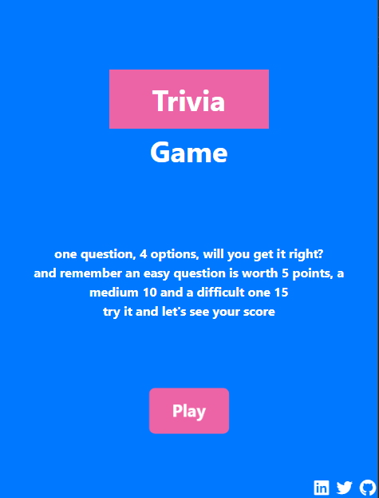
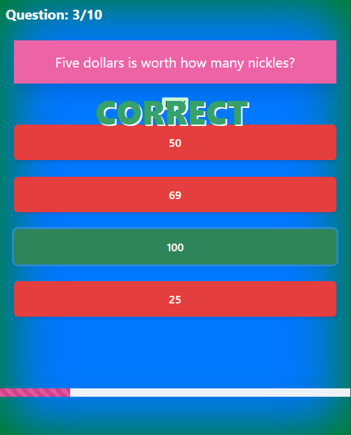
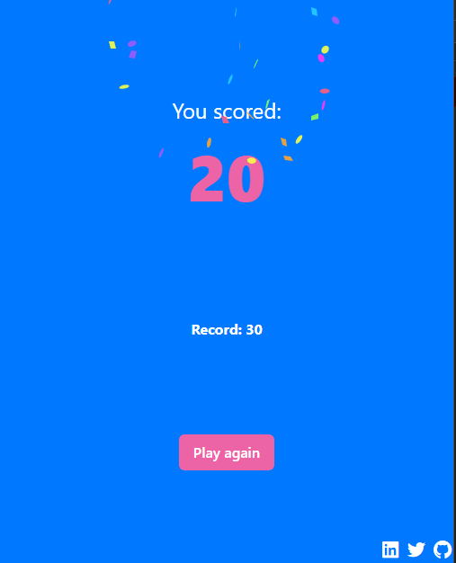

# Trivia game 🧠

Mini juego de preguntas y respuestas (multiple-choice) con su sistema de puntación.
Las tecnologías utilizadas fueron: ReactJs + ChakraUI

## Juego

El juego consiste en un total de 10 preguntas, irán pasando una por una tratando de acertar la opción correcta para sumar la mayor cantidad de puntos.

## Puntuación

El sistema de puntos es muy sencillo, dependiendo del nivel de dificultad varia la cantidad de puntos que sumamos:

- Easy(fácil): 5pts
- Medium(Normal): 10pts
- Hard(difícil): 15pts

cabe recalcar que nuestro récord de puntos será almacenado en el local storage

## Imágenes de la UI

